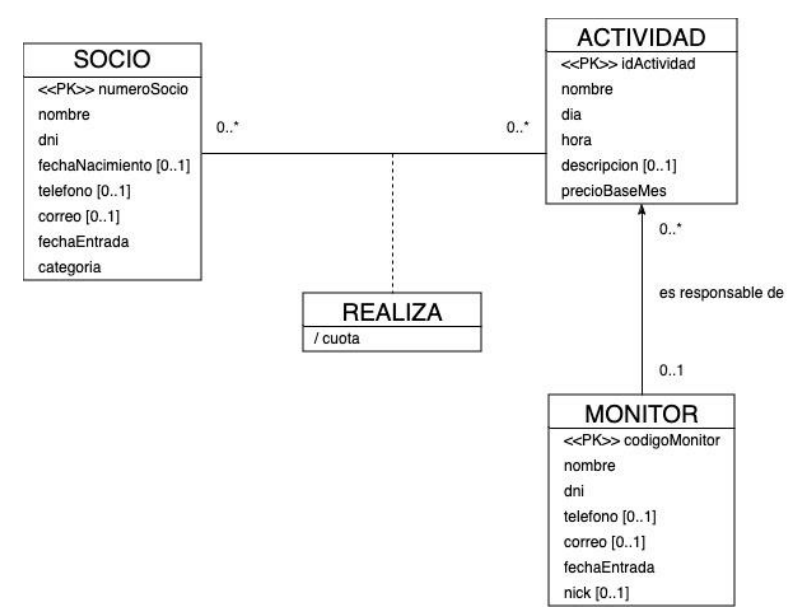

# 🏋️ GymToni – Sistema de Gestión de Gimnasio

**GymToni** es una aplicación de escritorio desarrollada como proyecto académico para la asignatura **Diseño y Desarrollo de Sistemas de Información (DDSI)**.
El objetivo es informatizar la gestión de un gimnasio, permitiendo la administración de socios, monitores y actividades, así como la gestión de inscripciones mediante una arquitectura **MVC** basada en **Java Swing**.

---

## 📌 Funcionalidades

- **Gestión de Socios, Monitores y Actividades:**
  - Operaciones CRUD (Crear, Leer, Actualizar, Borrar).
  - Validación de datos (campos obligatorios, formatos de fecha, DNI's únicos).
  - Filtrado dinámico de socios por nombre en tiempo real.
- **Gestión de Inscripciones:**
  - Alta y baja de socios en actividades mediante interfaz visual intuitiva.
  - Control de restricciones: evita duplicados y gestiona cupos o estados lógicos.
- **Interfaz Gráfica Avanzada:**
  - Uso de **Ventanas Modales (`JDialog`)** para formularios de alta y edición.
  - Tablas dinámicas (`JTable`) para la visualización de datos.
  - Mensajes de feedback al usuario (`JOptionPane`) para confirmar operaciones o alertar errores.
- **Manejo de Errores:**
  - Control de excepciones de base de datos y validación de integridad referencial.

---

## 📐 Diagrama Entidad-Relación

El sistema se fundamenta en un modelo de datos relacional robusto que garantiza la integridad referencial entre las tres entidades principales del dominio:

* **Socio:** Gestión de clientes, incluyendo su categorización para el cálculo de cuotas.
* **Actividad:** Clases ofertadas con horarios, precios base y asignación de recursos.
* **Monitor:** Personal encargado de impartir las actividades.

---

## 🧱 Arquitectura (MVC)

El proyecto sigue estrictamente el patrón **Modelo-Vista-Controlador** para desacoplar la lógica de negocio de la interfaz de usuario.

### Modelo
- **Entidades Persistentes:** Clases POJO (`Socio`, `Monitor`, `Actividad`) anotadas con JPA/Hibernate para el mapeo objeto-relacional.
- **DAOs:** Clases encargadas de la comunicación con la base de datos MariaDB a través de Hibernate.
- **Gestión de Sesiones:** Utilidad `HibernateUtil` para manejar la factoría de sesiones.

### Controlador
- **Listeners:** Clases como `ControladorInscripcion` que implementan `ActionListener` para capturar eventos de la interfaz.
- **Lógica de Negocio:** Coordina la interacción entre la Vista y el Modelo, gestionando las transacciones y validaciones antes de persistir datos.

### Vista
- **Paneles y Ventanas:** Clases que heredan de `JPanel` (ej. `VistaInscripcion`) y `JDialog` (ej. `VistaInscripcionCRUD`).
- **Componentes:** Diseño de formularios y tablas utilizando componentes Swing estándar.
- **Utilidades de Vista:** Clases auxiliares como `GestionTablaInscripcion` para renderizar y actualizar modelos de tablas.

---

## 🛠️ Tecnologías

### Frontend
- **Java Swing:** Librería gráfica para la construcción de la interfaz de usuario.
- **Componentes:** `JTable`, `JComboBox`, `JDialog` para una experiencia de usuario fluida.

### Backend
- **Java 21:** Versión del lenguaje utilizada.
- **Hibernate:** Framework ORM para el mapeo y persistencia de datos, eliminando gran parte del código SQL manual.
- **MariaDB:** Sistema Gestor de Bases de Datos Relacional.
- **JDBC:** Driver para la conexión física con la base de datos.

### Entorno de desarrollo (IDE)
- **NetBeans 22:** IDE utilizado para el desarrollo y diseño de las interfaces gráficas.
- **Maven:** Gestión de dependencias y construcción del proyecto.
- Arquitectura MVC (Modelo-Vista-Controlador)

---

## ▶️ Ejecución

1. **Base de Datos:**
   - Asegurarse de tener un servidor MariaDB en ejecución.
   - Importar un el script SQL para insertar algunas tuplas en la BD o hacerlo manualmente desde el Programa.
2. **Configuración:**
   - Revisar el archivo `hibernate.cfg.xml` para ajustar las credenciales de acceso a la BD si es necesario.
3. **Despliegue:**
   - Abrir el proyecto en **NetBeans 22**.
   - Ejecutar la clase principal (Main Class).
   - Iniciar sesión con las credenciales de usuario de MariaDB.

---

## 🎓 Objetivo Académico

- Implementar un Sistema de Información completo partiendo de un diseño E-R.
- Aplicar patrones de diseño profesionales (**MVC**, **DAO**).
- Dominar el uso de herramientas **ORM (Hibernate)** para la persistencia de datos.
- Desarrollar interfaces de escritorio robustas y funcionales con **Java Swing**.

---

## 📃 Documentación y Memoria Técnica del Proyecto

> **Nota:** Haz clic en el botón de arriba para visualizar o descargar el análisis completo en PDF, donde se explican las diferentes estrategias utilizadas, las comparativas detalladas con sus respectivas tablas de tiempos y la conclusión.

El código fuente se encuentra totalmente documentado siguiendo los estándares de Java (Javadoc).  
Puedes consultar la API generada abriendo el siguiente archivo en tu navegador web:

`target/reports/apidocs/index.html`

---

## ✅ Checklist

---

## 👤 Autor

**Antonio Abad Hernández Gálvez**
* GitHub: [@antonioabadpro](https://github.com/antonioabadpro)
* *Proyecto realizado para la Universidad de Huelva (UHU)*

---

## 📄 Licencia

Proyecto de uso académico para la Universidad de Huelva.  
© 2025. Todos los derechos reservados.
